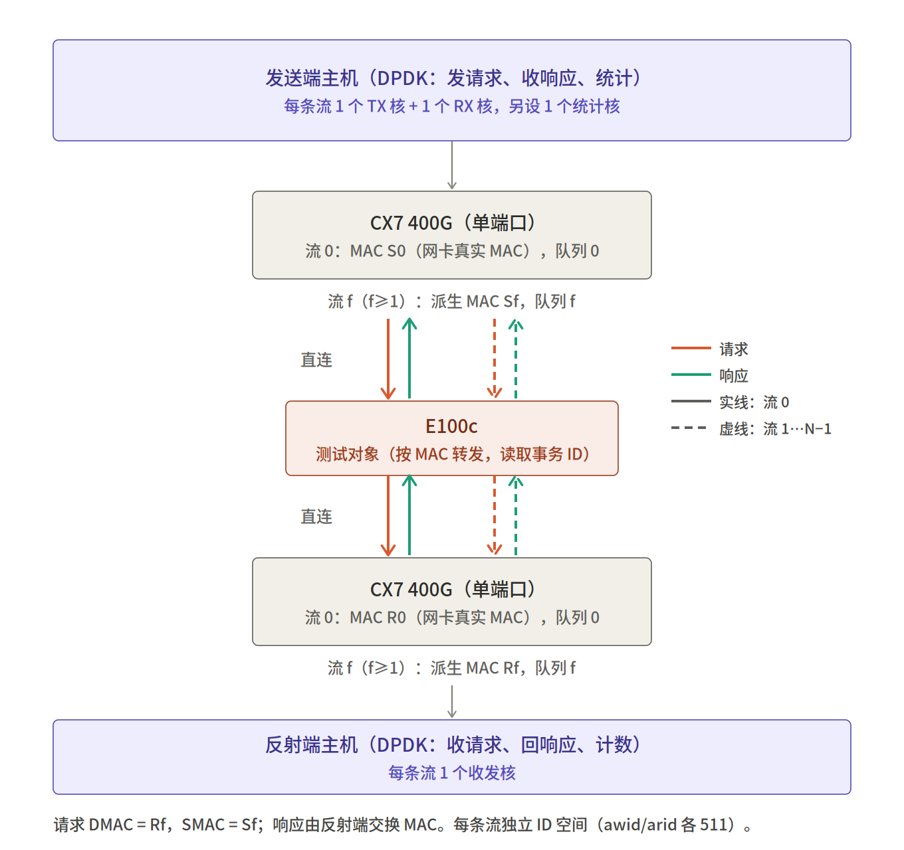

# AXI over Ethernet 环回测试 —— 测试拓扑与用例

版本：v0.8（草稿）　日期：2026-09-28
配套文件：`AXI包格式_v5_读写.xlsx`（逐字段报文格式）、测试程序 `axiperf`（仓库根目录，用法见 `README.md`）

| 版本 | 变更 |
|---|---|
| v0.8 | 新增两网卡结果（9.7）与本轮问题排查（9.8）；第 7 章补充第二块网卡、PCIe 拓扑、MaxReadReq、接收过滤、超线程配对核分配；第 8 章更新第 7、13 项，新增第 14 项（链路误码）；第 5、6 章补充超时回收与新增统计列 |
| v0.7 | 第 9 章更新至 2026-09-27：写、读方向 1~16 条流结果，调优实验，瓶颈分析；第 7 章补充 CPU / PCIe、隔离核、mlx5 调优配置；第 8 章新增瓶颈定位项 |
| v0.6 | 测试目标改为验证芯片聚合能力；不使用 VF，改为同一物理口上以 MAC 区分多条流；环境改为 DOCA 自带 DPDK 22.11；新增第 9 章阶段性测试结果；更新待确认项 |
| v0.5 | 拓扑图标注 MAC 与请求 / 响应数据流；单个 E100c 作为测试对象，网卡与 E100c 直连 |

---

## 1. 目的与范围

测试对象：**E100c**。

用两台主机上的 DPDK 软件，经 E100c 构造 AXI over Ethernet 的写、读闭环流量，验证 E100c 的芯片能力：

- 聚合吞吐：用多条流把 E100c 端口的数据方向链路打满。不要求单条流达到 100G。
- 满载下的事务往返时延（RTT）分布。
- 丢包、ID 异常等错误。

本文档覆盖测试拓扑、流量模型、测试用例、统计方法和阶段性结果。报文逐字段定义见配套 Excel。

---

## 2. 测试拓扑

两侧主机各用一块 CX7 400G 单端口网卡，与 E100c 用线缆直连。同一物理口上承载多条流，流之间以 MAC 区分。报文按 MAC 寻址。



> 图片文件 `AXI环回测试_拓扑.png`（另附矢量版 `.svg`）须与本文档放在同一目录。

<details>
<summary>文本版拓扑（图片无法显示时参考）</summary>

```
   ┌──────────────────────────────────────────────┐
   │  发送端主机（DPDK：发请求、收响应、统计）       │
   │  每条流 1 TX 核 + 1 RX 核，另 1 统计核          │
   └──────────────────────┬───────────────────────┘
               ┌──────────┴──────────┐
               │   CX7 400G 单端口    │  流 0：S0（真实 MAC），队列 0
               │                      │  流 f：Sf（派生 MAC），队列 f
               └──────────┬──────────┘
                     ↓ ↑  │  直连
               ┌──────────┴──────────┐
               │   E100c（测试对象）  │  按 MAC 转发，读取事务 ID
               └──────────┬──────────┘
                     ↓ ↑  │  直连
               ┌──────────┴──────────┐
               │   CX7 400G 单端口    │  流 0：R0（真实 MAC），队列 0
               │                      │  流 f：Rf（派生 MAC），队列 f
               └──────────┬──────────┘
   ┌──────────────────────┴───────────────────────┐
   │  反射端主机（DPDK：收请求、回响应、计数）       │
   │  每条流 1 收发核                                │
   └──────────────────────────────────────────────┘

   ↓ 请求（VC0 写 / VC1 读）：DMAC = Rf，SMAC = Sf
   ↑ 响应（VC2 / VC3）      ：DMAC = Sf，SMAC = Rf（反射端交换 MAC）
```

</details>

> 当前阶段（软件验证）E100c 尚未接入，两台主机经一台 H3C 交换机（VLAN 1）互通，见第 9 章。

### 2.1 角色

| 角色 | 职责 |
|---|---|
| 发送端 | 按窗口发写请求（VC0）、读请求（VC1）；接收写响应（VC2）、读响应（VC3）；统计吞吐与 RTT |
| 反射端 | 接收请求，按规则生成响应并回送；只做计数，不做时延统计 |
| E100c（测试对象） | 按 MAC 转发，不修改报文字段；解析报文读取事务 ID，按 MAC 维护在途 ID 表（每表上限 511） |

### 2.2 流的定义

- 一条流 =（发送端：一对 MAC、一对收发队列、一个 TX 核 + 一个 RX 核）↔（反射端：一对 MAC、一对收发队列、一个收发核）。
- 每条流拥有独立的 awid / arid 空间，各自在途 ≤ 511。流之间不共享任何快路径状态。
- 同一物理口上可承载 1~16 条流（`--flows N`），两端流数必须一致。
- 不使用 SR-IOV / VF。

### 2.3 MAC 与数据流

| 流 | 发送端 MAC | 反射端 MAC | 请求（VC0 / VC1） | 响应（VC2 / VC3） |
|---|---|---|---|---|
| 0 | S0 = 发送端网卡真实 MAC | R0 = 反射端网卡真实 MAC | DMAC = R0，SMAC = S0 | DMAC = S0，SMAC = R0 |
| f（≥1） | Sf = 派生自 S0 | Rf = 派生自 R0 | DMAC = Rf，SMAC = Sf | DMAC = Sf，SMAC = Rf |

**派生规则**：首字节置本地管理位（bit1 = 1）并清组播位（bit0 = 0），末字节加 f，其余字节不变。两端按同一规则独立推导，发送端只需通过 `--dmac` 给出 R0。

示例（mx-decode-02 → mx-decode-03）：

| 流 | 发送端 MAC | 反射端 MAC |
|---|---|---|
| 0 | a0:88:c2:76:b8:b4 | a0:88:c2:76:bb:6c |
| 1 | a2:88:c2:76:b8:b5 | a2:88:c2:76:bb:6d |

- 接收端开启混杂模式，并用 rte_flow 按 `eth dst = 本流 MAC` 把帧导到本流队列。
- 各流 MAC 在程序启动时打印（`flow p.f: queue … my MAC … peer MAC …`），接入 E100c 前按此配置 E100c 转发表（如需静态配置）。

---

## 3. 报文格式摘要

详见 `AXI包格式_v5_读写.xlsx`。

### 3.1 帧结构

```
DMAC(6) | SMAC(6) | TPID 0x8100(2) | PCP/DEI/VID(2) | Length(2) | AXI 事务 × k | FCS(4)
```

- 采用 raw 802.3 格式带 802.1Q tag，无 LLC 头，Length 之后直接是 AXI 事务。
- PCP = VC 编号；DEI = 0；VID 可配置（`--vid`）：直连 E100c 时为 0，当前经交换机阶段为 1。
- Length = Length 字段之后的有效 payload 字节数（不含 padding 和 FCS），≤ 1500。接收端按 Length 截断，忽略补齐字节。
- 以太头最终是否改用 SUEv1-标准ETH 格式（带 PackNum）尚待确认，见第 8 节。测试程序已支持 `--hdr sue`（试验性，EtherType / Format / PktType 可配），测试主体（AXI 事务、窗口、统计）与头格式无关。

### 3.2 VC 映射与事务格式

| VC（PCP） | 通道 | 事务 | frame_type |
|---|---|---|---|
| 0 | AW+W 写请求 | writefull 头 16B + 64B × (awlen+1) | 0000 |
| 0 | AW+W 写请求 | write 头 16B + (8B wstrb + 64B) × (awlen+1) | 0001 |
| 1 | AR 读请求 | read 头 16B | 0011 |
| 2 | B 写响应 | wrRsp 12B | 0010 |
| 3 | R 读响应 | rdRsp 头 4B + 64B × (rlen+1) | 0100 |

接收端按 frame_type 分发，PCP 仅做核对（不一致计入 `pcpx`）。

### 3.3 拼包规则

- VC0 / VC3：每包数据合计 ≤ 8 拍（512B）；一个 burst 不拆包；放不下时先发出当前包。
- VC1：每包 ≤ 4 个读请求。
- VC2：每包 ≤ 16 个写响应。

### 3.4 字段取值（性能测试）

| 字段 | 取值 |
|---|---|
| awlen / arlen | 3（每事务 4 拍，256B） |
| awsize / arsize | 3'b110（64B/拍） |
| writeFull（writefull） | 4'b1111 |
| awuser / awaddr / aruser / araddr | 不做要求（当前填 0） |
| bid / rid | 等于对应请求的 awid / arid |
| rlen | 等于 arlen |
| rlast | 1 |
| BRESP / RRESP | 00 |
| buser / ruser | 0 |
| wdata / rdata | 不做要求，固定 pattern（wdata 0xA5，rdata 0x5A） |

### 3.5 字节序

- 以太头字段按网络序（大端）。
- AXI 头部字段按 32 bit 字大端（最高字节先发）；数据按地址顺序（byte lane 0 先发）。
- E100c 需要解析事务 ID，以上约定须与 E100c 实现逐字段核对后方可接入（见第 8 节）。

---

## 4. 流量模型

### 4.1 ID 与窗口

- awid、arid 均为 9 bit，循环分配；同一 ID 在收到响应前不得再次发出。
- 每条流（每组 MAC）的每个 ID 空间在途事务 ≤ 511。该上限由 E100c 按 MAC 维护的 ID 表强制，发送端必须严格遵守。
- ID 超时后不得直接复用（E100c 表项可能未释放），须计为错误并停止该流。

### 4.2 反射端行为

| 收到 | 回送 | 映射 |
|---|---|---|
| VC0 写请求包（k 个写事务） | 1 个 VC2 包，含 k 个 wrRsp | 原地改写：交换 MAC、PCP 0→2、按事务填 bid、更新 Length |
| VC1 读请求包（k 个读） | ⌈k × 拍数 / 8⌉ 个 VC3 包 | burst 依次装入，超过 8 拍另起一包；从预填模板 mbuf 池分配 |

- 同一流内按接收顺序处理和发送，保证响应顺序。
- 任何响应不得丢弃；`tx_burst` 未发完须重试。
- 每攒够 `--burst` 个响应即发出，降低批处理时延。

### 4.3 带宽口径

| 口径 | 包含内容 | 计算 |
|---|---|---|
| 线上速率 | 以太帧 + 前导码/SFD 8B + IFG 12B | pps × (帧长 + 20) × 8 |
| L2 帧速率 | 以太帧，含 FCS | pps × 帧长 × 8 |
| 网卡字节计数 | 以太帧，不含 FCS（mlx5 `ibytes/obytes` 默认口径） | pps × (帧长 − 4) × 8 |
| AXI 数据 | 仅 wdata / rdata | pps × 每包数据字节 × 8 |

链路利用率 = 线上速率 / 链路速率。"链路打满"指数据方向链路利用率达到 100%。

### 4.4 理论值（以每 100G 线速为单位；400G 口按 ×4）

| 用例 | 数据方向 | 帧长 | 每 100G pps | 每 100G AXI 数据 | 反方向 |
|---|---|---|---|---|---|
| 纯写 2 × 256B | 去程（Length 544） | 566B | 21.33 M | 87.4 G | 写响应 64B，约 14% 链路 |
| 纯读 2 × 256B | 回程（Length 520） | 542B | 22.24 M | 91.1 G | 读请求 64B，约 15% 链路 |
| 读写混合 | 双向 | — | 写 18.54 M + 读 19.47 M | 写 75.9 G + 读 79.8 G | 双向各 100% |

400G 口数据方向打满：纯写约 85.3 Mpps、AXI 数据约 350 G；纯读约 89.0 Mpps、AXI 数据约 364 G。

### 4.5 窗口、RTT 与所需流数

单条流吞吐受窗口限制：

> 单流事务速率 ≤ 511 / RTT（满载 RTT）

达到目标事务速率 X 所需流数：

> N ≥ X × RTT / 511

| 目标（纯写 2 × 256B） | 事务速率 X | RTT = 12 µs | RTT = 20 µs（当前实测，见第 9 章） |
|---|---|---|---|
| 100G | 42.7 M/s | 1 条 | 2 条 |
| 400G | 170.6 M/s | 4 条 | 7 条 |

读写混合时 awid / arid 两个 ID 空间各自独立（按 AXI 语义），每条流两个方向各 511。

---

## 5. 测试用例

### 5.1 第一优先级

| 编号 | 名称 | 流数 | 流量 | 窗口 | 主要指标 | 通过标准 |
|---|---|---|---|---|---|---|
| TC-01 | 功能连通 | 1 | 写、读各少量，低速；配合 `--pcap` 抓包核对 | 1~4 | 响应字段正确性 | bid/rid、frame_type、PCP、Length 全部正确；ID 连续；无错误计数 |
| TC-02 | 空载 RTT 基线 | 1 | 写 2×256B、读 2×256B 分别测 | 1 | RTT 分布 | 记录 P50/P99/max，作为 E100c + 主机固定时延基线 |
| TC-03 | 写单流满窗 | 1 | 写 2×256B | 511 | 吞吐、RTT、各核 busy | 记录单流上限（受 511 / RTT 限制，不要求 100G）；零丢包；无 ID 错误 |
| TC-04 | 读单流满窗 | 1 | 读请求 2 个/包，读响应 2×256B | 511 | 同上 | 同上 |
| TC-05 | 写流数扫描 | 1, 2, 4, 8 | 写 2×256B | 511/流 | 每流及合计吞吐、RTT、各核 busy | 合计吞吐随流数线性增长，直至数据方向链路利用率 ≥ 目标（待定，建议 ≥ 99%）；流间偏差 ≤ 5%（待定） |
| TC-06 | 读流数扫描 | 1, 2, 4, 8 | 读 2×256B | 511/流 | 同上 | 同上（回程方向） |
| TC-07 | 窗口扫描 | 1 | 写、读分别 | 1, 64, 128, 256, 511 | 吞吐-窗口曲线、RTT | 判定吞吐受限于时延还是处理能力 |
| TC-08 | 读写混合 | 1 → N | 写、读同时满载 | 写、读各 511/流 | 双向吞吐、RTT | 双向链路利用率均达标 |

### 5.2 第二优先级

| 编号 | 名称 | 流数 | 流量 | 主要指标 | 说明 |
|---|---|---|---|---|---|
| TC-11 | 写最大拼包 | 1 → N | write(0001) × 8，每事务 1 拍 + wstrb，Length 704 | 吞吐、RTT | 每事务仅 64B，单流 RTT 预算约 3.8 µs，需更多流数 |
| TC-12 | 读请求 4 个/包 | 1 → N | 读请求 4 个/包 → 2 个读响应包 | 吞吐、反射端 CPU 负载 | 验证 1:2 拆包；对比 TC-04 的反射端核负载 |
| TC-13 | 读响应最大拼包 | 1 → N | rdRsp × 8，每个 1 拍，Length 544 | 吞吐、RTT | 单流 RTT 预算约 3.0 µs |
| TC-14 | 统计开销 | 1 | 同 TC-03，统计开 / 关各跑一次 | 吞吐差异 | 量化统计本身开销 |

### 5.3 通用执行要求

- 反射端先启动且测试全程不退出：不加 `--time`，或给出明显长于发送端的时间（如发送端 30 s、反射端 120 s），并在反射端启动后立即启动发送端。反射端提前退出时，发送端各流会同时出现整窗（510 个事务）倍数的 lost。
- 两端 `--flows`、`--vid`、`-a` 网卡组合必须一致。
- 每个终端先设置 `DEV`（mlx5 devargs，见第 7 章）；未带 devargs 时程序会告警，包率约低 20%。
- 每个满载用例运行 10 s 以上，取发送端结束时的汇总行；同时记录反射端运行期间的一行。
- 每次运行前后采集网卡（及 E100c）计数，差值写入结果。
- 任一错误计数非零即判为不通过，并保存现场计数。
- 抓包与性能测试分开进行。

---

## 6. 统计方法（axiperf 输出）

统计核每 1 s 输出一次，每条流一行（编号 `端口.流`）；结束时输出全程平均（`total/avg`）。

| 列 | 含义 |
|---|---|
| txMpps / rxMpps | 发 / 收包速率 |
| txWireG / rxWireG | 线上速率 =（帧长，不足 60 补 60）+ FCS 4B + 前导码 / IFG 20B |
| txnM/s | 完成事务数（仅发送端） |
| dataG | AXI 数据 Gbps（仅发送端） |
| meanus / p50us / p99us / p999us / maxus | RTT；按 burst 取 TSC；0~200 µs 为 50 ns 一档，200 µs~100 ms 为 100 µs 一档 |
| slow | RTT > 200 µs 的事务数 |
| busyT% / busyR% | 发送端 TX / RX 核忙碌占比（反射端只看 busyR%），接近 100% 即该核为瓶颈 |
| cyc/pk | 每个包（收、发各计一次）消耗的 CPU 周期 |
| rxB | 每次非空 rx_burst 的平均包数，接近 64 表示该端接收有积压 |
| err | ID 异常（重复响应、超时回收后迟到）、Length 越界、frame_type 与 VC 不符等 |
| lost | 超过 `--timeout-us`（默认 10 ms）未收到响应、被回收的事务数，即丢失 |
| ign | 非 AXI 背景帧数（DHCP、LLDP、启动时的地址学习广播帧等，已忽略） |
| xmac | DMAC 不是本流地址的 AXI 帧数（交换机泛洪副本等），已丢弃、反射端不回 |
| pcpx | PCP 与 VC 不一致的帧数（用于发现中间设备改写 PCP） |
| imissed / nombuf | 网卡侧丢包（描述符 / mbuf 不足） |

- RTT 口径：事务所在 burst 调用 `tx_burst` 前的 TSC，到其响应所在 burst `rx_burst` 返回后的 TSC，即 CPU 感知的往返时延。
- 快路径无日志、无锁、无内存分配；各核只写自己的计数。
- 超时回收：窗口满或下一个 ID 被占时检查，最老的在途事务超过 `--timeout-us` 即回收其 ID 并计入 lost，流继续运行。9 bit ID 无法区分迟到响应与复用后的新请求的响应。反射端 `--drop-every N` 可模拟丢包验证该路径。
- 抓包：`--dump N` 打印前 N 帧十六进制；`--pcap FILE --pcap-count N` 写 pcap 文件（纳秒时间戳，性能会下降）。

---

## 7. 环境与配置

| 项 | 当前配置 |
|---|---|
| 主机 | mx-decode-02（发送端）、mx-decode-03（反射端）；Intel Xeon Platinum 8460Y+（Sapphire Rapids），2 × 40 核，160 逻辑 CPU，2 NUMA |
| 网卡 | 每台 2 块 NVIDIA ConnectX-7 MCX75310AAS-NEAT，400GbE 单端口 OSFP：0000:12:00.0（ens2np0）与 0000:33:00.0（ens3np0），均在 NUMA 0；PCIe Gen5 x16（32GT/s，两台均已确认）；固件 02 为 28.47.1088、03 为 28.49.1014；以太网 pause 关闭。MAC：02 为 a0:88:c2:76:b8:b4 / a0:88:c2:76:cc:1c，03 为 a0:88:c2:76:bb:6c / a0:88:c2:76:cc:0c |
| PCIe 拓扑 | 两块网卡都经**两级 PCIe 交换芯片**接到不同的 CPU 根端口（12:00.0：03:01.0 → 04:00.0/05:0c.0 → 0f:00.0/10:10.0；33:00.0：2d:01.0 → 2e:00.0/2f:00.0 → 30:00.0/31:10.0），距 CPU 的级数相同 |
| MaxReadReq（必须） | 默认 256B，改为 **4096B**：`setpci -s <BDF> CAP_EXP+8.w=<原值 bits14:12 置 5>`。须在 axiperf 停止时修改；重启、网卡复位、驱动重载后恢复为 256，需重新设置。两网卡写吞吐提升 13%（见 9.8） |
| DPDK | DOCA 自带 22.11.2410（`/opt/mellanox/dpdk`），与已装驱动配套；DPDK 可用 lcore 编号须 < 128 |
| 驱动 | mlx5 bifurcated，无需绑定 vfio；不使用 SR-IOV |
| 收包 | eth 头非混杂：每条流一条 rte_flow 规则（DMAC → 本流队列），流 MAC 加入网卡 MAC 过滤，其余单播由网卡丢弃；软件再核对一次 DMAC（`xmac`）。`--promisc` 可恢复混杂模式。RX 关闭 VLAN strip |
| 大页 | `vm.nr_hugepages=8192`（2MB，每 NUMA 4096），写入 `/etc/sysctl.d/80-hugepages.conf` 持久化 |
| CPU 隔离 | 内核参数 `isolcpus=managed_irq,domain,<核> nohz_full=<核> rcu_nocbs=<核> irqaffinity=<其余核>`；`/etc/default/irqbalance` 设置 `IRQBALANCE_BANNED_CPULIST`；governor = performance。当前隔离 24-39,104-119（node0 上 16 个物理核及其超线程兄弟）；`irqaffinity=0-23,40-103,120-159`。注：当前内核（5.15 generic）不支持 nohz_full，时钟中断仍存在，影响为微秒级 |
| 核分配 | 统计核放非隔离核 23。程序按网卡所在 NUMA 节点为每条流选核（取该节点编号最小的空闲 lcore，发送端先 TX 后 RX），启动时打印 `flow p.f -> lcore n`。发送端推荐**超线程配对**：流 k 的 TX 在 CPU 24+k、RX 在其超线程兄弟 104+k，每流只占 1 个物理核，性能与收发各占 1 个物理核相当（见 9.7）：`LC=0@23; for k in $(seq 0 15); do LC+=",$((2*k+1))@$((24+k)),$((2*k+2))@$((104+k))"; done; ./axiperf --lcores "$LC" ...`。反射端每流 1 核 |
| EAL 参数 | 建议加 `--huge-unlink`：进程被杀后不残留大页文件（否则需手动清理 `/dev/hugepages/rtemap_*`） |
| mlx5 devargs（必须） | `mprq_en=1,rxqs_min_mprq=1,mprq_log_stride_num=9,txq_inline_mpw=128,rxq_pkt_pad_en=1`，两端每块网卡都加。8 条流吞吐提升 43%（见 9.4）；程序检测到缺失时告警 |
| CQE 压缩 | 关闭（`mlxconfig … CQE_COMPRESSION=0`，BALANCED）。开启会使吞吐下降约 14%（见 9.4） |
| burst | `--burst 16`（两端） |
| MTU | 最大帧 726B，默认即可 |
| 无损 | 直连 E100c 时两侧在 PCP 0~3 上启用 PFC；当前经交换机阶段未配置 |
| mbuf | 发送端请求、反射端读响应使用专用 mempool 预填模板；写响应在接收 mbuf 上原地改写 |

---

## 8. 待确认项

| # | 项 | 影响 | 澄清结果 |
|---|---|---|---|
| 1 | E100c ID 表粒度 | 决定多流是否有效、每流在途上限 | 按 MAC 划分（已定）。待确认：按源 MAC / 目的 MAC / MAC 对；芯片最多同时跟踪多少个 MAC；awid 与 arid 是否分表 |
| 2 | E100c 对 AXI 头字节序、Length 口径、拼包格式的解析实现 | 不一致则 E100c 读错 ID | 待澄清；接入前以十六进制样包逐字段核对 |
| 3 | E100c 转发与 MAC 表 | 接入前配置步骤 | 按 MAC 转发、不修改报文字段、会读取事务 ID（已确认）。待确认：MAC 表自动学习还是静态配置；如需静态配置，按程序打印的各流 MAC 配置 |
| 4 | E100c 对 VID=0（priority tag）与 PCP→VC 的支持；PFC 配置 | 无损与 VC 隔离 | 待澄清 |
| 5 | 吞吐与 RTT 的通过门限（"CPU 可接受的链路时延"） | TC-05 / TC-06 通过标准 | 待澄清。参考：511 窗口下单流打满 100G 需满载 RTT ≤ 12 µs |
| 6 | 读写混合是否必测 | TC-08 | 待澄清；按 awid / arid 各 511 设计 |
| 7 | 发送端超时门限及超时后的处理 | 错误判定 | 待澄清门限。程序已实现超时回收：默认 10 ms（`--timeout-us`），回收 ID 计入 lost，流继续运行 |
| 8 | 是否需要校验 rdata 内容 | 读响应能否继续用固定模板 | 待澄清 |
| 9 | write(0001) 类型的 writeFull 取值规则 | 仅影响 TC-11 | 待澄清 |
| 10 | 物理形态 | 核分配、配置 | 不使用 VF；同一物理口上以 MAC 区分多条流（已定） |
| 11 | 以太头最终格式：802.3 + Length，还是 SUEv1-标准ETH + PackNum | 帧头长度、解析规则、网卡收包方式 | 待澄清；程序两种都支持（`--hdr eth` / `--hdr sue`），sue 的 EtherType、Format、PktType 编码与 PktType 位宽（5 或 6 bit）待确认 |
| 12 | 当前交换机型号与单跳时延 | 解释第 9 章 RTT 基线 | 待澄清（估计往返约 4 µs）；可用 02 与 03 直连跑 `ib_write_lat -s 566` 对比量化 |
| 13 | 约 78 Mpps 处饱和的环节（写约 365G、读约 348.5G） | 当前环境读写上限 | 部分定位：是**每块网卡**的上限，不是共享环节——两网卡合计线性扩展到 157 Mpps（见 9.7），交换机与主机总线不是瓶颈。MaxReadReq 由 256 改为 4096 后提升 13%。剩余每卡约 78 Mpps（写 92% 线速）的限制来源（网卡包处理或两级 PCIe 交换芯片时延）未再细分 |
| 14 | 02 的 ens2np0（12:00.0）链路质量 | 丢包会计入 E100c 结果 | 待处理：Link Down 21 次，raw BER 8E-9（另一口 6E-10），FEC 未纠正错误 944、CRC 错误 4，错误集中在 lane 1；实测造成过响应丢包。建议查光模块各 lane 光功率（`mlxlink -m`）、清洁或更换光纤 / 光模块、与另一口对调定位 |

---

## 9. 阶段性测试结果（截至 2026-09-28，经 H3C 交换机，未接 E100c）

环境：mx-decode-02（发送端）→ H3C 交换机（VLAN 1）→ mx-decode-03（反射端），`--vid 1`。9.1~9.5 为单网卡（12:00.0），MaxReadReq 256；9.7 为两网卡，MaxReadReq 4096。
流量：写为 writefull 2 × 256B / 包（帧长 566B），读为 2 个读请求 / 包、响应 2 × 256B / 包（帧长 542B），每流窗口 511。
除特别说明外，所有结果 err = 0、imissed = 0、nombuf = 0。

### 9.1 时延基线与构成

| 测量 | 结果 | 说明 |
|---|---|---|
| ib_write_lat -s 566（单程） | 3.98 µs（典型），往返约 8.0 µs | 网卡 + PCIe + 链路 + 交换机硬件路径下限 |
| axiperf 窗口 1 | RTT p50 8.85 µs，p99 9.15 µs | 比硬件路径仅多约 0.9 µs |
| 反射端处理（抓包时间戳） | 约 0.3 µs | 收请求到发响应 |

8 条流满载（RTT 24.8 µs）时的构成：

| 组成 | 时延 |
|---|---|
| 硬件往返 | 约 8.0 µs |
| 软件空载开销 | 约 0.9 µs |
| 满载排队 | 约 16 µs |

### 9.2 写吞吐（TC-03 / TC-05）

| 流数 | 配置 | 合计 Mpps | 线上速率 | AXI 数据 | 平均 RTT | p99 RTT | 发送端 busy（TX / RX） |
|---|---|---|---|---|---|---|---|
| 1 | 核未隔离 | 5.68 | 26.6G | 23.3G | 45 µs | — | 99%（单核） |
| 1 | 核隔离，单核收发 | 11.73 | 55.0G | 48.0G | 21.8 µs | 22.1 µs | 99%（单核） |
| 1 | 核隔离，收发分核 | 12.24 | 57.4G | 50.1G | 19.4 µs | 22.2 µs | 73% / 78% |
| 2 | 同上 | 23.24 | 109.0G | 95.2G | 19.9 µs | 23.6 µs | 61% / 65% |
| 4 | 同上 | 41.59 | 194.9G | 170.4G | 22.2 µs | 26.6 µs | 58% / 57% |
| 8 | 同上 | 52.0 | 244G | 213G | 37.5 µs | 42.9 µs | 39% / 39% |
| 8 | + mlx5 devargs | 74.3 | 348.6G | 304G | 25.4 µs | 32.6 µs | 52% / 44% |
| 8 | + devargs + `--burst 16` | 74.9 | 351G | 307G | 24.8 µs | 31.0 µs | 64% / 45% |
| **16** | **+ devargs + `--burst 16`，`--nosplit`** | **77.9** | **365G** | **318G** | 51.1 µs | 63.0 µs | 52%（单核） |

说明：

- 1、2、4 条流未加 mlx5 devargs，与 8、16 条流的最终配置不一致，**待用最终配置补测**（见 9.9）。
- 16 条流时线上速率为 400G 的 91%。

### 9.3 读吞吐（TC-04 / TC-06）

最终配置：mlx5 devargs、`--burst 16`、CQE 压缩关闭；读请求 2 个 / 包（`--pack 2`）。数据方向为回程，看发送端 rxWireG。

| 流数 | 合计 Mpps（读请求） | 回程线上速率 | AXI 读数据 | 平均 RTT | p99 RTT | 发送端 busy（TX / RX） |
|---|---|---|---|---|---|---|
| 1 | 12.08 | 54.3G | 49.5G | 18.3 µs | 21.8 µs | 49% / 88% |
| 2 | 22.85 | 102.8G | 93.6G | 19.5 µs | 23.3 µs | 46% / 84% |
| 4 | 43.49 | 195.5G | 178.1G | 20.7 µs | 24.9 µs | 45% / 80% |
| 8 | 75.30 | 338.5G | 308.5G | 24.4 µs | 30.4 µs | 35% / 71% |
| **16**（`--nosplit`） | **77.52** | **348.5G** | **317.8G** | 50.8 µs | 58.7 µs | 48%（单核） |

说明：

- 16 条流时回程线上速率为 400G 的 87%。
- 发送端 RX 核在读方向负载较高（要解析 542B 响应），但随流数增加而下降，不是瓶颈。

### 9.4 调优实验（8 条流写，除注明外）

| 项 | 变化 | 结论 |
|---|---|---|
| 收发核隔离（`isolcpus`） | 1 流：5.68 → 11.73 Mpps；RTT max 20 ms → 0.2 ms | 必须；否则调度抢占造成毫秒级卡顿并使窗口停滞 |
| 发送端收发分核 | 1 流：11.73 → 12.24 Mpps；busy 99% → 73% / 78% | 采用 |
| mlx5 devargs（MPRQ、TX inline） | 52.0 → 74.3 Mpps；RTT 37.5 → 25.4 µs | 必须；未加时网卡接收 64B 响应积压（`rx_buffer_passed_thres_phy` 增长） |
| `--burst 16` | 74.3 → 74.9 Mpps；RTT 25.4 → 24.8 µs | 小幅收益，采用 |
| CQE 压缩（AGGRESSIVE） | 74.9 → 64.7 Mpps；RTT 24.8 → 29.2 µs；rxB 32 → 55 | **负收益，保持关闭**：完成事件合并增加批量等待，窗口受限场景下时延比 CPU 更关键 |
| 代码伪共享（重构引入，已修复） | 4 流 cyc/pk 约 190 → 约 110 | `next_id` 与收包核常读字段同 cache line；已移到发包核独占的 cache line |

### 9.5 瓶颈分析

| 流数 | 写：合计 Mpps / 平均 RTT | 读：合计 Mpps / 平均 RTT |
|---|---|---|
| 4 | 41.6 / 22.2 µs | 43.5 / 20.7 µs |
| 8 | 74.9 / 24.8 µs | 75.3 / 24.4 µs |
| 16 | 77.9 / 51.1 µs | 77.5 / 50.8 µs |

- 读、写两个方向都在约 78 Mpps 处饱和：8 → 16 条流吞吐仅 +3%~4%，RTT 翻倍，多出的窗口全部变为排队；表现为均匀限速、不丢包。
- 两个方向帧长接近（566B / 542B）而数据流向相反，饱和点相同，说明瓶颈是与方向无关、与包速率相关的共享环节。
- 已排除：
  - 发送端 CPU：busy 约 35%~64%。
  - 反射端 CPU：8 条流写时每核 busy 约 57%（该次测量在 CQE 压缩开启时，读方向反射端负载尚未记录）。
  - 以太网 pause：两端均关闭，无计数。
  - PCIe 链路速率：两端均为 Gen5 x16。
- 待查：
  - 网卡包处理 / PCIe 读能力：每块网卡同时承担约 78 Mpps 发和 78 Mpps 收；查 `outbound_pci_stalled_rd`、MaxReadReq。
  - 交换机：02 与 03 直连对比。

### 9.6 单网卡结论（MaxReadReq 256）

1. 单条流吞吐受 511 窗口与满载 RTT 限制（`事务速率 ≤ 511 / RTT`），约 12 Mpps（写 57G / 读 54G）；须多条流叠加（独立 MAC、独立 ID 空间）提升吞吐。
2. 单网卡 16 条流：写 77.9 Mpps / 365G（91% 线速）/ 318G AXI 数据；读 77.5 Mpps / 348.5G（87%）/ 318G。全程无错误、无丢包。
3. 必要配置：收发核隔离、mlx5 MPRQ / TX inline devargs；CQE 压缩保持关闭。
4. 满载 RTT 中硬件约 8 µs、软件约 1 µs，其余为排队。

### 9.7 两网卡吞吐（2026-09-28）

配置：两端各 2 块网卡（12:00.0 + 33:00.0），每卡 8 条流共 16 条；MaxReadReq 4096；mlx5 devargs；`--burst 16`；发送端超线程配对（每流 1 个物理核），反射端每流 1 核；err = 0、lost = 0、imissed = 0。

| 方向 | 卡 | 合计 Mpps | 大包方向线上速率 | AXI 数据 | 平均 RTT | p99 RTT | 发送端 busy（TX / RX） |
|---|---|---|---|---|---|---|---|
| 写 | 12:00.0 | 78.9 | 369.8G（92%） | 323.0G | 23.3 µs | 29.3 µs | 62% / 54% |
| 写 | 33:00.0 | 78.4 | 367.6G（92%） | 321.2G | 23.6 µs | 29.6 µs | 62% / 55% |
| **写** | **合计** | **157.3** | **737.4G** | **644.2G** | | | |
| 读 | 12:00.0 | 76.5 | 343.9G（86%） | 313.4G | 23.9 µs | 29.6 µs | 32% / 90% |
| 读 | 33:00.0 | 76.3 | 342.9G（86%） | 312.3G | 24.0 µs | 29.7 µs | 32% / 90% |
| **读** | **合计** | **152.8** | **686.8G** | **625.7G** | | | |

单网卡对照（33:00.0，8 条流，写，同一轮最终配置）：

| 核分配 | 合计 Mpps | 线上速率 | AXI 数据 | 平均 RTT | 每流 Mpps |
|---|---|---|---|---|---|
| 收发各占 1 个物理核 | 76.3 | 358.0G（89.5%） | 312.7G | 23.9 µs | 9.54 |
| 两网卡时（超线程配对） | 78.4 | 367.6G | 321.2G | 23.6 µs | 9.80 |

结论：

1. 两网卡合计为单网卡的 2 倍，线性扩展；约 78 Mpps 是每块网卡的上限，交换机与主机侧无共享瓶颈。4 网卡按每卡 8 条流、超线程配对，发送端需 32 个物理核（及其超线程），反射端需 32 个核，且每卡的核须在该卡所在 NUMA 节点。
2. 超线程配对不降低性能，每流只占 1 个物理核。
3. 读方向发送端 RX 线程 busy 已达 90%（解析 542B 响应），是读方向下一个瓶颈；继续加流或窗口前，读测试应给 RX 线程独立物理核。
4. 满载 RTT 约 24 µs，每流在途约 460 个事务，仍是窗口受限。

### 9.8 本轮问题与排查记录

| # | 现象 | 原因 | 处理 |
|---|---|---|---|
| 1 | 两网卡首次测试：大部分流发几百到几千包后停住，err 数千 | 同一主机两口在同一交换机同一 VLAN，交换机泛洪未知单播，混杂模式下副本被另一口收下：发送端记为重复响应，反射端从错误的口回包，交换机把流 MAC 学到错误端口 | eth 头改为非混杂 + 每流 rte_flow + 软件核对 DMAC（`xmac`）；启动时每流发 4 个广播帧让交换机重新学习 |
| 2 | 修复 1 后仍有流在开头停住，无任何丢包计数 | 交换机 MAC 表残留错误表项，开头的响应被送到错误端口后由网卡丢弃；程序无超时，丢一个响应该流永久停住 | 加超时回收与 lost 计数；启动广播帧纠正 MAC 表 |
| 3 | 个别流速率低约 23%，lost 为奇数 | 超时回收的扫描从 next_id+1 开始，漏掉了挡住分配的 next_id 本身，丢包后该流永久停住 | 修复扫描起点；反射端 `--drop-every` 在 memif 上复现并验证 |
| 4 | 单网卡、两网卡都只有约 57~61 Mpps，cyc/pk 约 130 | 新终端中 `DEV` 为空，mlx5 devargs 未生效 | 设置 DEV 后单网卡恢复到 76.3 Mpps；程序在缺少 devargs 时告警 |
| 5 | MaxReadReq 256 | 网卡读 566B 包需拆成 3 个读请求，经两级 PCIe 交换芯片 | 改为 4096：两网卡（未带 devargs 时）写 115.4 → 130.4 Mpps，RTT 33.3 → 27 µs |
| 6 | Ctrl-C 无法退出、残留大页 | 网卡状态异常时端口 stop/close 挂住 | 第二次 Ctrl-C 强制退出；建议 `--huge-unlink` |
| 7 | 读测试 16 条流 lost 均为 510 的整数倍且相同 | 反射端 `--time` 先于发送端到期退出 | 反射端时间明显长于发送端；见 5.3 |
| 8 | 12:00.0（02 侧）Link down/up、CRC 错误，实测丢过响应 | 链路误码，集中在 lane 1 | 暂未更换，见第 8 节第 14 项；每组测试检查 lost 与 `rx_crc_errors_phy` |

### 9.9 下一步

1. 4 网卡：确认另外两块网卡的 NUMA 位置与 PCIe 路径，按每 NUMA 节点规划隔离核（每卡 8 个物理核 + 超线程兄弟），更新 GRUB 与 irqbalance 配置。
2. 读方向发送端 RX 核：给 RX 线程独立物理核复测，确认读方向每卡上限。
3. 处理 02 ens2np0 链路误码（第 8 节第 14 项）。
4. 读写混合（TC-08）。
5. 接入 E100c 前完成第 8 节第 1~4、11 项澄清。
6. （可选）用最终配置补测单网卡写 1、2、4 条流。
